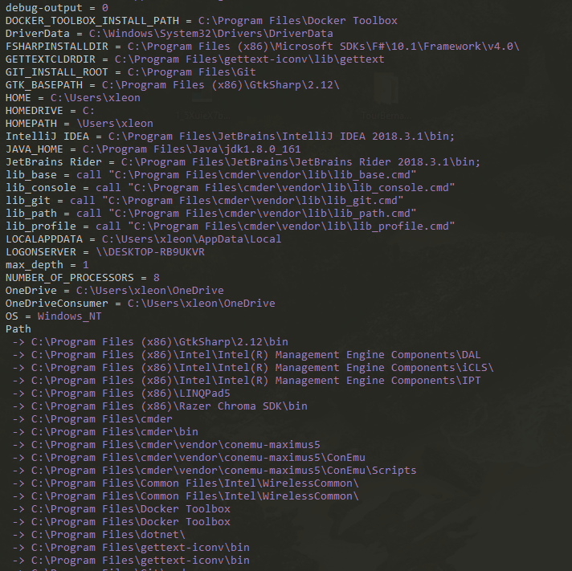

# LogEnv

DotNet global tool to log environment variables ordered by name and break inner values (like path) into multiple lines.

<p align="center">
  
</p>

# Install

Make sure you have dotnet core installed at your machine.

```console
dotnet tool install --global LogEnvTool
```

# Use

From anywhere in your system:

```console
logenv
```
    
